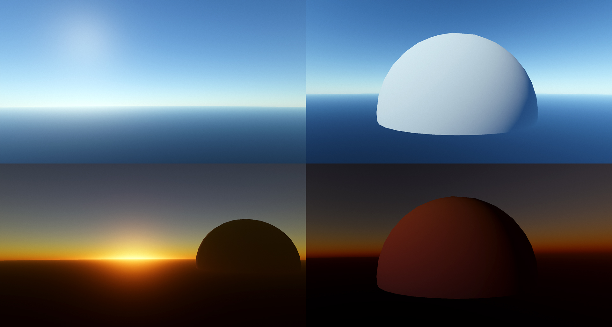

# MinimalAtmosphere
A minimal (single cginc file) atmospheric scattering implementation for Unity to use as a base for further work and as a reference for anyone wanting to learn. Includes a simple skybox and object shader. No optimizations are implemented and so it probably should not be used in an actual application.

Above all else, this repository aims to be easy to understand, and although implemented in Unity, the shader file does not make use of any Unity-specific code, meaning it can be ported easily. The file containing the implementation is [Assets/Atmosphere/Shaders/Atmosphere.cginc](https://github1s.com/Fewes/MinimalAtmosphere/blob/master/Assets/Atmosphere/Shaders/Atmosphere.cginc)

Supports Rayleigh and Mie (single) scattering + ozone absorption. The object shader also shows how atmospheric transmittance can be used to attenuate the directional light (planet shadow).

The project is using URP (just to get screen tonemapping and dithering) but you can export the atmosphere part to any pipeline, just grab the Atmosphere directory from Assets.

This repository represents my current best understanding of atmospheric scattering, so I happily accept corrections on things that are implemented incorrectly, just raise an issue and I will check it out.

# Recommended reading
[A Scalable and Production Ready Sky and Atmosphere Rendering Technique](https://sebh.github.io/publications/egsr2020.pdf)
